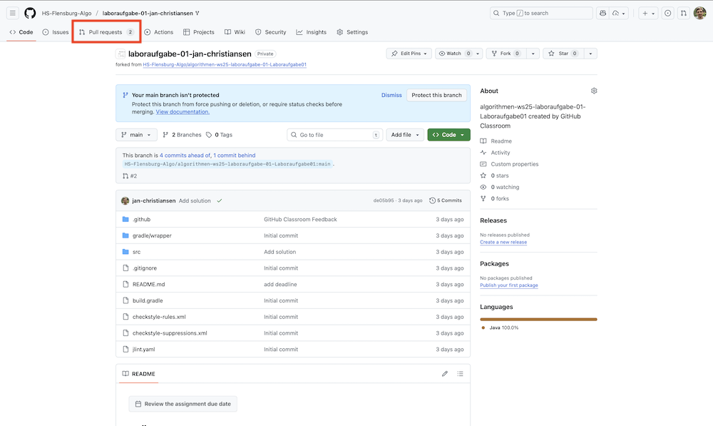
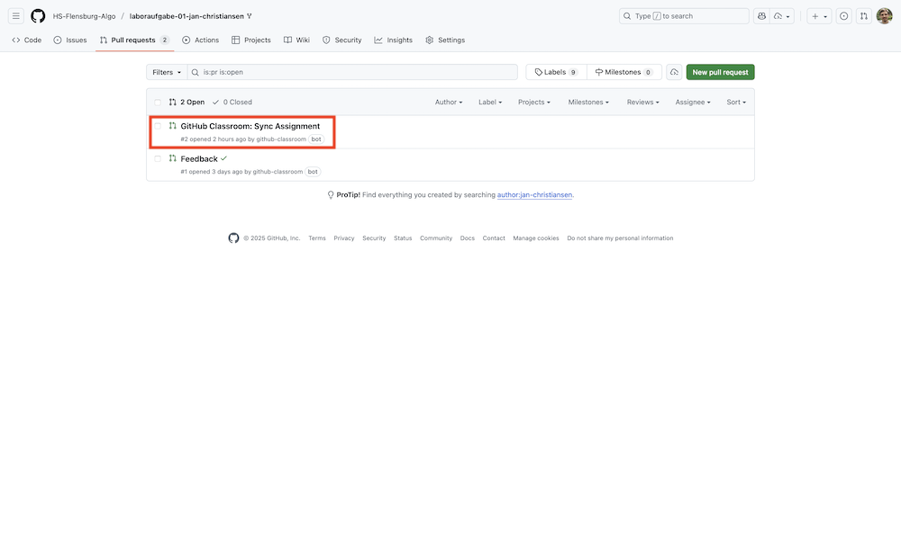
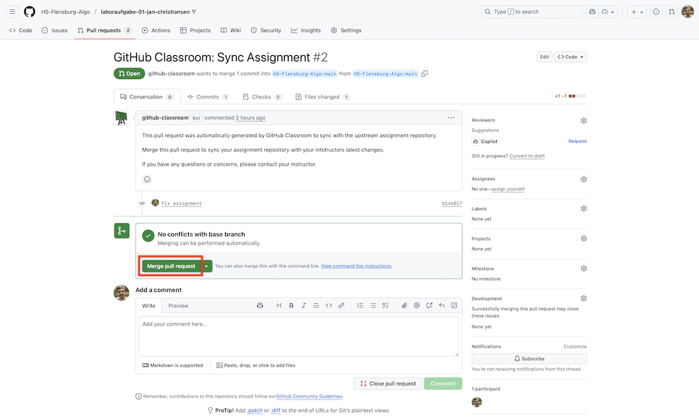
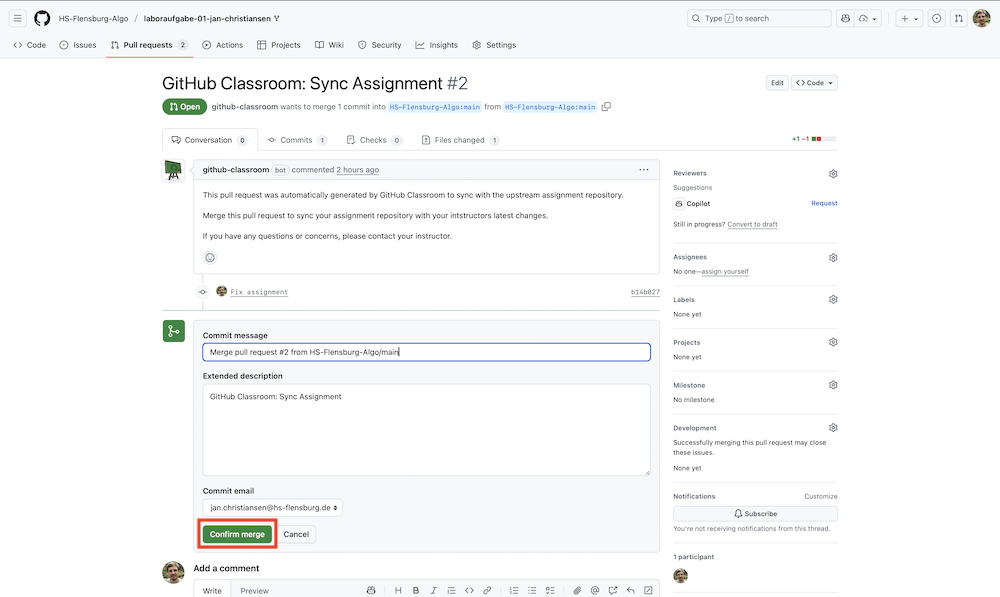

Auf dieser Seite finden Sie Informationen zur Arbeit mit GitHub-Classroom.

## Nachträgliche Änderungen an der Aufgabe

Es kann passieren, dass sich ein Fehler in der Aufgabenstellung befindet.
In diesem Fall kann mittels GitHub-Classroom nachträglich eine Änderung in alle bereits geklonten _Repositories_ eingespielt werden.
In diesem Abschnitt wird beschrieben, wie diese nachträglichen Änderungen in ein bestehendes _Repository_ übernommen werden.

Wechseln Sie im _Repository_ mit der Aufgabe in den Abschnitt `Pull Requests`.

Es sollte in diesem Bereich einen _Pull Request_ geben, der `GitHub Classroom: Sync Assignment` heißt.
Wählen Sie diesen aus.

Wählen Sie die Option `Merge pull request` und anschließend `Confirm merge`.

Nun werden die Änderungen, die an der Aufgabenstellung vorgenommen wurden, bei Ihnen im _Repository_ hinzugefügt.
Bevor Sie an Ihrer Aufgabe weiterarbeiten können, müssen Sie den Befehl `git pull` ausführen.
Dieser Befehl zieht die Änderungen, die Sie bei GitHub durch das Mergen des _Pull Requests_ vorgenommen haben, in die lokale Kopie des _Repositories_.

