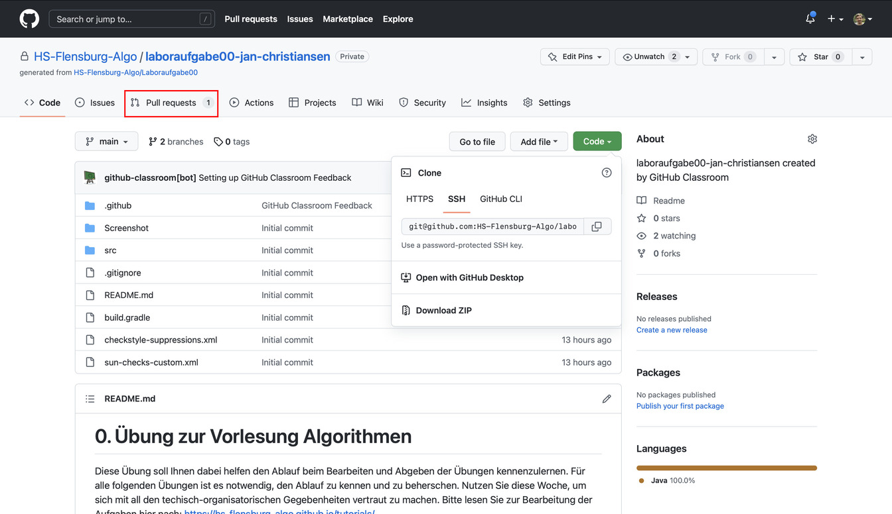
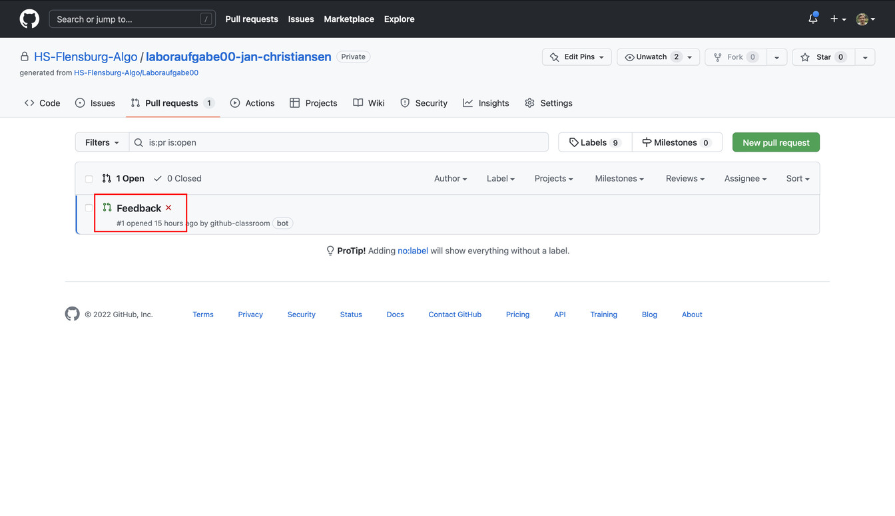
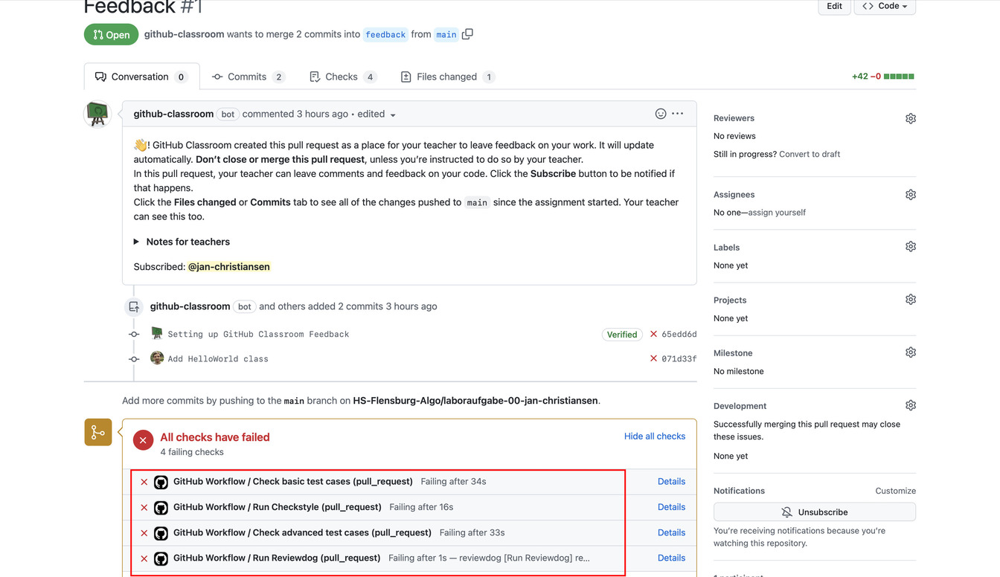
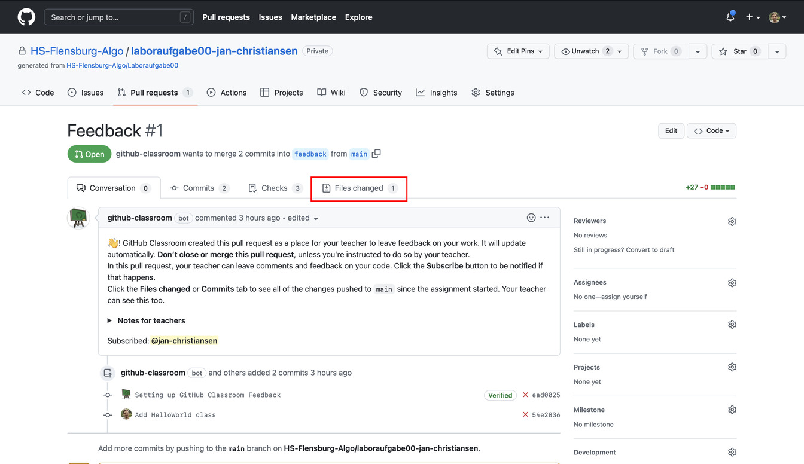
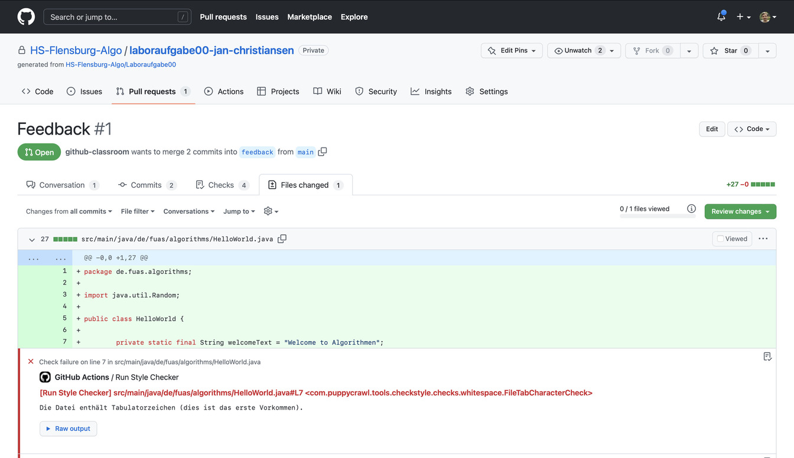
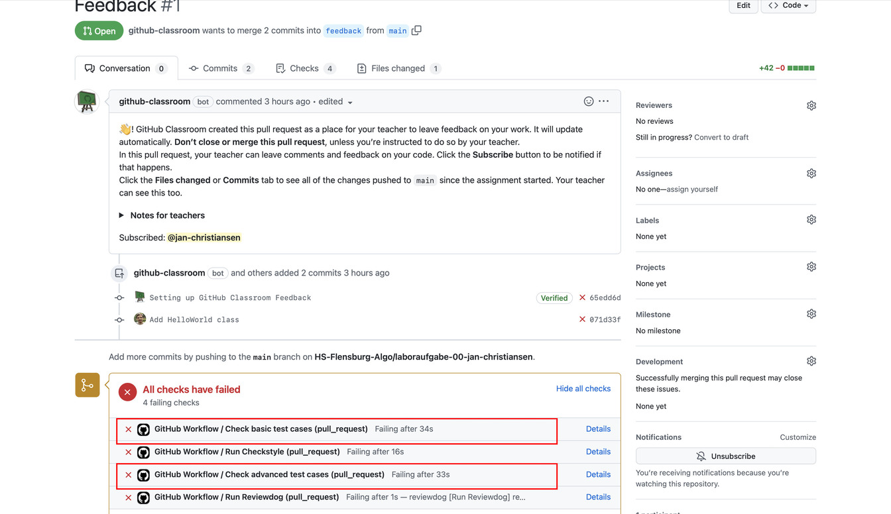
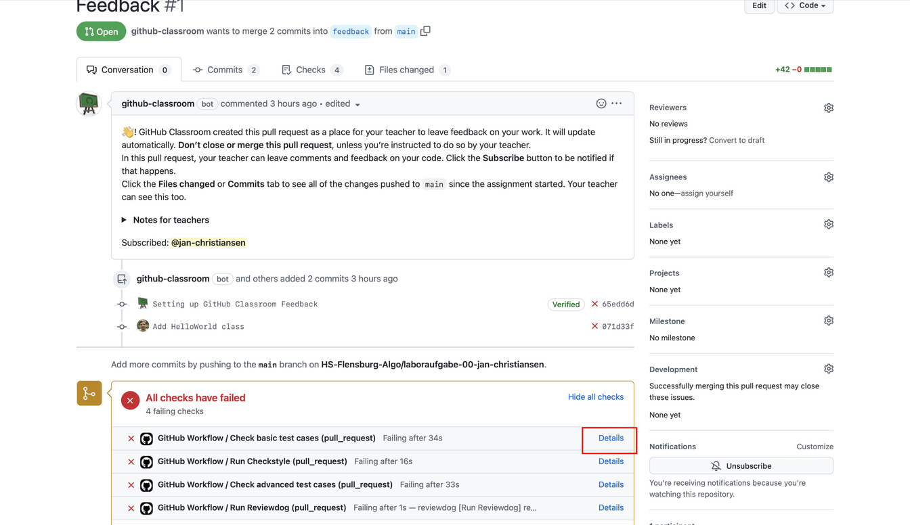
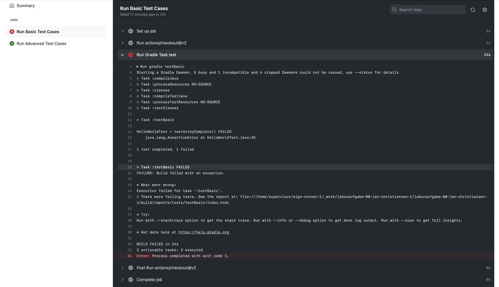

Auf dieser Seite finden Sie Informationen zu dem Feedback, dass Sie automatisiert bei GitHub erhalten.
Die _Repositories_ mit den Laboraufgaben sind so konfiguriert, dass automatisch geprüft wird, dass Sie sich an bestimmte Programmierregeln halten und dass die Testfälle alle erfolgreich sind.
Die automatische Überprüfung der Programmierregeln wird aktuell durch zwei Anwendungen durchgeführt, die man auch als Linter bezeichnet.
Die Anwendung [Checkstyle](https://checkstyle.sourceforge.io) ist ein im Java-Bereich verbreiteter Linter.
Die Anwendung jlint wurde im Rahmen mehrerer Bachelor-Projekte entwickelt und prüft ebenfalls die Einhaltung von Programmierregeln.
Ein Tool namens [reviewdog](https://github.com/reviewdog/reviewdog) sorgt dann dafür, dass die Anmerkungen der beiden Linter bei GitHub an den richtigen Stellen des Codes angezeigt werden.

Um zu den Anmerkungen der automatischen Überprüfungen zu gelangen, müssen Sie zuerst den Reiter `Pull requests` wählen.

Es sollte dort einen _Pull Request_ geben, der `Feedback` heißt.
Wählen Sie diesen bitte aus.
Falls dieser _Pull Request_ nicht existiert, nehmen Sie bitte Kontakt zu mir auf.

**Bitte schließen oder mergen Sie einen _Pull Request_ nicht.**

Das rote Kreuz zeigt an, dass die automatischen Überprüfungen noch Fehler gefunden haben:

In dem _Pull Request_ namens Feedback können Sie sehen, welche der Überprüfungen Fehler gefunden hat.
Dazu müssen Sie auf der Seite etwas runterscrollen.
Die Fehler werden durch ein rotes Kreuz signalisiert.
Es gibt drei verschiedene Überprüfungen.
Im _Pull Request_ werden vier Überprüfungen angezeigt, da die Ausführung des Linters aus zwei Schritten besteht.
Beim Schritt `Run linter` werden die Linter Checkstyle und jlint ausgeführt.
Beim Schritt `Run reviewdog` werden die Anmerkungen der Linter so aufbereitet, dass Sie an die einzelnen Zeilen des Codes bei GitHub geschrieben werden.

## Stil-Anmerkungen des Linters

Der Linter überprüft, dass Sie sich an Grundregeln der Programmierung unter Java halten bzw. gibt Tipps, wie die Struktur des Codes verbessert werden kann.
Im _Pull Request_ mit dem Namen _Feedback_, können Sie oben den Reiter `Files changed` auswählen.

Unter `Files changed` sehen Sie alle Änderungen, die Sie an dem Code im _Repository_ durchgeführt habt.
Dort können Sie auch zeilenweise die Anmerkungen des Linters sehen.
Die Anmerkung steht jeweils unter der Codezeile, auf die sich die Anmerkung bezieht.

In diesem Fall merkt der _reviewdog_ zum Beispiel an, dass man im Quellcode die Einrückung des Codes mit Leerzeichen und nicht mit Tabulatoren machen sollte.

## Testfälle

Während der Linter einige Stilaspekte der Implementierung prüft, prüfen JUnit-Testfälle, ob die geforderten Methoden sich korrekt verhalten.
Dabei reicht es allerdings nicht, sich auf die Testfälle zu verlassen, da Testfälle immer nur endlich viele Beispielwerte testen, während eine Methode ggf. unendlich viele mögliche Eingaben hat.
Daher ist es trotz der Testfälle wichtig, sich zu überlegen, ob das Verhalten der Methode sinnvoll ist.

Es gibt zwei Gruppen von Testfällen.

Die `Basic test cases` enthalten grundlegende Prüfungen der Funktionalität und sollten schon zum initialen Abgabetermin grün sein.
Die `Advanced test cases` testen Verhalten ab, das erfahrungsgemäß etwas schwieriger umzusetzen ist.
Diese Testfälle müssen erst zur Abgabe der Überarbeitung grün sein.

Die Testfälle können einfach in IntelliJ ausgeführt werden, sodass die Lösung nicht hochgeladen werden muss, um zu prüfen, ob die Testfälle erfüllt sind.
Im Abschnitt [IntelliJ](intellij.md) wird erläutert, wie man die Testfälle in IntelliJ ausführt.

Man kann grundsätzliche Informationen über die Testfälle auch direkt bei GitHub einsehen.
Dazu muss man auf `Details` klicken.

Man erhält dann die Ausgabe, welche die Ausführung der Testfälle liefert.

In dieser Ausgabe kann man zum Beispiel ablesen `1 test completed, 1 failed`, das heißt, ein Testfall wurde ausgeführt und ein Testfall ist dabei fehlgeschlagen.
Die Angabe `HelloWorldTest > testArrayComplete() FAILED` besagt, dass der Testfall mit dem Namen `testArrayComplete` in der Klasse `HelloWorldTest` fehlgeschlagen ist.
