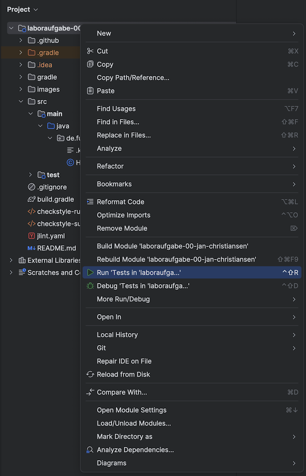

Im Rahmen der Vorlesung wird [IntelliJ](https://www.jetbrains.com/de-de/idea/) des Unternehmens JetBrains als IDE verwendet.
IntelliJ wird in zwei Versionen angeboten:

- Community
- Ultimate

Beide Versionen können im vollen Umfang für die Bearbeitung der Laboraufgaben genutzt werden.
Eine Auflistung der Unterschiede finden Sie [hier](https://www.jetbrains.com/de-de/idea/).
Im Wesentlichen beziehen sich diese auf die Unterstützung weiterer Sprachen, Datenbanken und bekannter Frameworks.

Wenn Sie planen IntelliJ ausschließlich für diese Veranstaltung zu nutzen, empfiehlt sich die Community-Version.
Diese steht grundsätzlich kostenlos zur Verfügung und kann ohne Registrierung genutzt werden. 

Wollen Sie JetBrains-Produkte im vollen Umfang testen und auch in anderen Kursen verwenden, empfiehlt sich die Ultimate-Version. 
Diese wird zwar regulär entgeltlich angeboten, steht Ihnen als Studierende jedoch auch kostenlos für die Dauer Ihres Studiums zur Verfügung. 

Beide Versionen lassen sich von der [Produktseite](https://www.jetbrains.com/de-de/idea/) herunterladen.
Sollten Sie sich für die Ultimate-Version entscheiden, ist eine Registrierung und Bestätigung Ihres Studierendenstatus erforderlich. 
Folgen Sie dazu den entsprechenden Anweisungen im Abschnitt [Benutzererstellung und Aktivierung](#benutzererstellung-und-aktivierung). 

## Benutzererstellung und Aktivierung (nur für Ultimate)

*Dieser Abschnitt ist nur relevant, wenn Sie die Ultimate-Version nutzen möchten.*

Um die Ultimate-Version nutzen zu können, benötigen Sie einen JetBrains-Account und müssen diesen mit Ihrem Studierendenstatus verknüpfen.
Die Verknüpfung findet dabei über GitHub statt.

1. Öffnen Sie [GitHub](https://github.com/) und melden Sie sich mit Ihrem Account an.
2. Öffnen Sie Ihre Profileinstellungen und navigieren Sie zu `Emails`.
3. Fügen Sie hier ihre Email-Adresse der Hochschule Flensburg hinzu (endet auf @stud.hs-flensburg.de).
4. Anschließend bekommen Sie von GitHub eine Bestätigungs-Email zugeschickt. Öffnen Sie diese und klicken Sie auf `Confirm email address`.
5. Öffnen Sie GitHubs [Studierendenportal](https://education.github.com/) und melden Sie sich mit Ihrem GitHub-Account an.
6. Klicken Sie auf `Join Global Campus` und anschließend auf `Yes, I'm a student`. 
7. Wählen Sie in dem untenstehenden Formular Ihre Hochschul-Email-Adresse aus, schreiben Sie einen kurzen Text in das folgende Textfeld und klicken Sie auf `Continue`.
8. Fügen Sie ein Bild Ihrer Studierendenbescheinigung bei und klicken Sie auf `Process my application`.
    - Die Verifizierung durch GitHub dauert in der Regel nur wenige Minuten.
9. Öffnen Sie nun JetBrains [Studierendenportal](https://www.jetbrains.com/shop/eform/students).
10. Klicken Sie auf `GitHub` und anschließend auf `Mit GitHub autorisieren`.
11. Melden Sie sich mit Ihrem GitHub-Account an und klicken Sie auf `Authorize`.
12. Folgen Sie den Anweisungen des Formulars und klicken Sie auf `Kostenlose Produkte beantragen`
13. Über die [Lizenzverwaltung](https://account.jetbrains.com/licenses) können Sie nun Ihr `JetBrains Product Pack for Students` aktivieren und alle Produkte von JetBrains herunterladen.

## Import eines Projekts

Den Import eines Projekts von GitHub können Sie wie folgt in IntelliJ durchführen.

1. Klonen Sie das Projekt in einen beliebigen Ordner auf Ihrem Rechner.
2. Öffnen Sie IntelliJ und wählen Sie `Open`.
3. Navigieren Sie zu dem Ordner, in dem Sie das Projekt abgelegt haben, und wählen Sie diesen aus.

Ihre Projektstruktur in IntelliJ sollte nun etwa wie folgt aussehen.
Es dauert einen kleinen Moment bis IntelliJ die Struktur analysiert hat und korrekt anzeigt.


## Einstellungen

### Formatierung

Sie sollten IntelliJ so konfigurieren, dass die Java-Dateien automatisch beim Speichern formatiert werden.
Die Linter-Regeln überprüfen, ob die Dateien, die Sie hochladen, formatiert sind.
Gehen Sie zum Aktivieren des automatischen Formatierens in die Einstellungen und wählen Sie unter `Tools > Actions on Save` die Option `Reformat code`.
Beim nächsten Speichern ihrer Klassen sollte IntelliJ die Datei formatieren.


### Design

IntelliJ startete mit der Version 2022.3 den Umstieg auf ein neues Design, welches in kommenden Updates als Standard festgelegt werden wird. 
Einen Vergleich können Sie dem folgenden Screenshot entnehmen, wobei links das neue und rechts das alte Design zu sehen ist. 


Welches Design sie verwenden, bleibt Ihnen überlassen, die Einstellungen finden Sie unter `File > Settings > Appearance & Behavior > New UI`.

## JUnit-Testfälle

In diesem Abschnitt erfahren Sie, wie sie Testfälle in IntelliJ ausführen können.

### Ausführen

Wenn die Aufgabenstellung Testfälle zur Verfügung stellt, können diese mit einem Rechtsklick auf das Projekt und Auswahl des Menüpunkts `Run 'Tests in '[Name]''` ausgeführt werden. 
Alternativ kann auch der Kurzbefehl `Ctrl + Shift + F10` (oder `Ctrl + Shift + R` unter MacOS) verwendet werden.



Beim erstmaligen Ausführen der Tests werden Sie über einen Dialog gefragt, welche Tests Sie ausführen möchten. 
Häufig stellt Ihnen die Aufgabe `basic` und `advanced` Testfälle bereit. 
Wählen Sie an dieser Stelle unbedingt `test` aus, um alle Tests auszuführen. 


### Testeinstellungen anpassen

Sollten Sie beim Ausführen der Testfälle `basic` oder `advanced` gewählt haben, müssen Sie die Test-Konfiguration womöglich anpassen, um auch die übrigen Tests ausführen zu können. 

1. Klicken Sie im Menüband auf `Run > Edit Configurations...`.
2. Klappen Sie in der linken Seite des geöffneten Dialogs `Gradle` auf und klicken Sie auf `Tests in 'Laboraufgabe ...'`.
3. Ändern Sie den Inhalt des Felds `Run` entsprechend des folgenden Screenshots zu `:test`. 


### Testergebnisse

Nach Durchlaufen der Tests öffnet sich im unteren Bereich des Fensters ein Dialog, der Ihnen die Ergebnisse der Tests anzeigt.
Der folgende Screenshot zeigt beispielhaft, wie mehrere Tests fehlgeschlagen sind.


Sie sehen hier in welcher Klasse der Test fehlgeschlagen ist, welche Methode fehlgeschlagen ist und warum.

### Symbolbeschreibung

Die Ergebnisse der einzelnen Tests werden Ihnen mit Symbolen gekennzeichnet. 
Beachten Sie, dass Tests aus Testklassen gruppiert werden und womöglich ausgeklappt werden müssen, um nähere Informationen anzeigen zu lassen.

####  - Erfolgreich

Ein bestandener Test wird durch einen grünen Haken gekennzeichnet. 


Durch die Voreinstellungen werden bestandene Tests ausgeblendet. 
Die Anzeigeeinstellung können Sie über den ersten Button in der Symbolleiste ändern.

####  - Nicht Erfolgreich

Das rote Kreuz kennzeichnet, dass mindestens ein Test fehlgeschlagen ist. 
Dieser Fall tritt ein, wenn der Code fehlerfrei ausgeführt wird, sich das Testergebnis aber von dem erwarteten Wert unterscheidet. 

Um nähere Informationen zu erhalten, können Sie den fehlgeschlagenen Test im Dialog auswählen. 
In der Konsole wird Ihnen dann ausgegeben, wie sich der erwartete und tatsächliche Wert unterscheiden.
Sie können auch einen Doppelklick auf den fehlerhaften Test tätigen, um automatisch die entsprechende Klasse zu öffnen und zur betreffenden Stelle im Code zu springen.

####  - Exception

Durch ein rotes Ausrufezeichen wird gekennzeichnet, dass das Ausführen des Codes zu einer Exception geführt hat und abgebrochen wurde. 

Gründe für das Auftreten von Exceptions sind vielfältig.
Daher empfiehlt es sich weitere Informationen darüber einzuholen, welche Exception ausgelöst wurde und wodurch. 
Die Informationen können Sie sich analog zu den nicht erfolgreichen Tests über einen Klick auf den Test anzeigen lassen.

Anhand des folgenden Beispiels können Sie nachvollziehen, welche Informationen Sie aus einer Fehlermeldung ziehen können:

##### Beispiel

```
Index 1 out of bounds for length 1
java.lang.ArrayIndexOutOfBoundsException: Index 1 out of bounds for length 1
    at de.fuas.algorithms.Arrays.expandArray(Arrays.java:7)
    at de.fuas.algorithms.ArrayList.add(ArrayList.java:23)
    at de.fuas.algorithms.ArrayListTest.testAddNull(ArrayListTest.java:63)
```
- Zeile 1: Es wurde eine Exception ausgelöst, weil auf einen Index `1` zugegriffen wurde, welcher außerhalb der zugewiesenen Array-Länge `1` liegt.
  - Gültig wäre hier nur ein Index `0 <= index <= array.length() - 1`.
- Zeile 2: Bei der Exception handelt es sich um eine `ArrayIndexOutOfBoundsException`.
- Zeile 3: Die Exception wurde beim Ausführen der Funktion `expandArray` der Klasse `Arrays` im Package `de.fuas.algorithms` ausgelöst. `Arrays.java:7` informiert Sie darüber, dass der Fehler in Zeile `7` aufgetreten ist.
- Zeile 4: Die Funktion `expandArray` wurde innerhalb der Funktion `add` der Klasse `ArrayList` aufgerufen. 
- Zeile 5: Die Funktion `add` wurde innerhalb der Funktion `testAddNull` der Klasse `ArrayListTest` aufgerufen.
